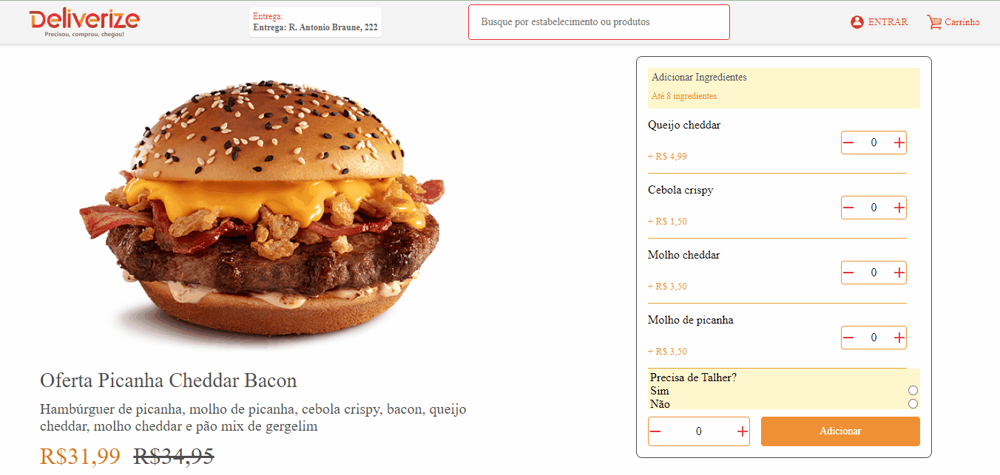

# Hamburguer Delivery
Esse projeto consiste em uma page que um determinado usuário vai comprar o seu lanche podendo acrescentar alguns ingredientes.

## Instalação
1. Clone o repositório: git clone https://github.com/tobiasramos/hamburguer-delivery.git
2. Acesse o diretório do projeto: cd hamburguer-delivery
3. Instale as dependências: npm install

## Uso
1. Execute o projeto localmente: npm start
2. Abra o navegador e acesse: http://localhost:3000

## Tecnologias utilizadas
 - HTML
 - CSS
 - JAVASCRIPT
 - REACTJS

## Projeto em execução
